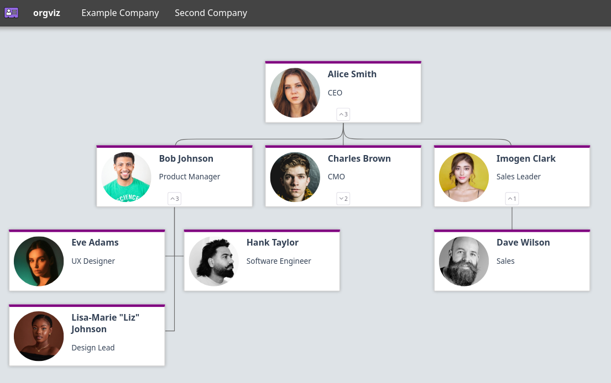

  
  <h1>orgviz</h1>

  Visualize collections of people.

## Screenshots

orgviz v2 renders to a web interface.
orgviz v1 renders to a static image, such as a PNG or SVG.

## Getting started

orgviz is installed as a docker container, and run with a .yml organization file. Avatars are stored in the "avatars" directory in your config docker volume.

To get started, see https://jamesread.github.io/orgviz/ for the documentation.

## Credits

Example avatars all from plexels.com.
